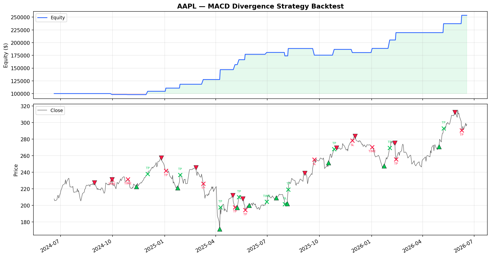

# MACD Divergence Trading Strategy

A multi-platform MACD divergence detection and trading system — web dashboard, Pine Script indicator, MQ5 indicator & EA, Python indicator & backtest.

## Overview

Detects 4 types of divergence between price and MACD using swing-point analysis:

| Type | Pattern | Signal | Context |
|------|---------|--------|---------|
| Regular Bullish | Price LL, MACD HL | BUY | Reversal in downtrend |
| Regular Bearish | Price HH, MACD LH | SELL | Reversal in uptrend |
| Hidden Bullish | Price HL, MACD LL | BUY | Continuation in uptrend |
| Hidden Bearish | Price LH, MACD HH | SELL | Continuation in downtrend |

---

## Platforms

### 1. Next.js Web Dashboard (`src/`)

Professional dark-themed technical analysis dashboard with AI chat assistant.

**Tabs:**
- **Dashboard** — Summary cards, price overview, active signals grid
- **Trade Setups** — 16 divergence setups across AUD/USD, XAU/USD, ETH/USD, BTC/USD with entry/SL/TP levels, win probability, and risk-reward ratios
- **Divergence Guide** — Educational content with SVG pattern references

**AI Chat** — Floating widget powered by NVIDIA Kimi K2.6 for trade analysis Q&A.

```bash
npm install
cp .env.example .env   # add NVIDIA_API_KEY
npm run dev             # http://localhost:3000
```

### 2. Pine Script Indicator (`MACD Divergences_lines.pine`)

TradingView indicator (Pine Script v6). Plots MACD, Signal, Histogram, and draws divergence lines + labels directly on the MACD subwindow.

**Inputs:** Fast Length (12), Slow Length (26), Signal Smoothing (9), Swing Lookback (5).

### 3. MQ5 Indicator (`MACD_Divergences.mq5`)

MetaTrader 5 custom indicator. Same logic as the Pine Script — draws divergence trend lines and text labels in a separate indicator window.

**Setup:** Copy to `MQL5/Indicators/`, compile in MetaEditor, attach to chart.

### 4. MQ5 Expert Advisor (`MACD_Divergence_EA.mq5`)

MetaTrader 5 automated trading EA using the divergence strategy.

**Entry rules:**
- Regular Bullish / Hidden Bullish → Long
- Regular Bearish / Hidden Bearish → Short

**Exit rules:**
- Stop Loss: 3% from entry
- Take Profit: 6% from entry
- Time exit: 20-bar max hold

**Features:**
- Position sizing from risk % of balance
- Auto SL/TP on order submission
- Magic number filtering for multi-EA compatibility
- Configurable: allow/disallow shorts, SL/TP %, max hold bars

```bash
# Copy to MQL5/Experts/, compile, attach to chart
```

### 5. Python Indicator (`macd_divergences.py`)

Standalone Python script that fetches data via yfinance and plots MACD with divergence annotations using matplotlib.

```bash
pip install yfinance matplotlib numpy pandas
python macd_divergences.py                    # default: AAPL 6mo
python macd_divergences.py                    # or use as library:
```

```python
from macd_divergences import run
run("TSLA", period="1y", interval="1d", swing_lookback=5)
```

### 6. Python Backtest (`backtest.py`)

Backtests the MACD divergence strategy on historical data with configurable parameters.

**Strategy:** Long on bullish divergences, short on bearish divergences, exit via SL/TP/time.

```bash
python backtest.py
```

**Default config (editable in `BacktestConfig`):**
- Initial capital: $100,000
- SL: 3%, TP: 6%, Max hold: 20 bars
- Commission: 0.1% round-trip

**AAPL 2Y Backtest Results:**

| Metric | Value |
|---|---|
| Return | +153.64% |
| Sharpe | 2.22 |
| Max Drawdown | 6.94% |
| Win Rate | 76.2% (16/21) |
| Profit Factor | 6.45 |
| Avg Bars Held | 9.0 |

Hidden divergences achieved 100% win rate (10/10). Regular Bearish was weakest at 43%.

---

## Project Structure

```
├── src/                          # Next.js web dashboard
│   ├── app/
│   │   ├── api/chat/route.ts     # AI chat API (NVIDIA proxy)
│   │   ├── globals.css
│   │   ├── layout.tsx
│   │   └── page.tsx
│   ├── components/
│   │   ├── ai-chat.tsx
│   │   └── ui/button.tsx
│   └── lib/utils.ts
├── MACD Divergences_lines.pine   # Pine Script v6 indicator
├── MACD_Divergences.mq5          # MQ5 custom indicator
├── MACD_Divergence_EA.mq5        # MQ5 Expert Advisor
├── macd_divergences.py           # Python indicator + plotter
├── backtest.py                   # Python backtest engine
├── backtest_results.png          # Backtest equity curve
└── video/                        # Remotion video project

### Backtest Results (AAPL 2Y)



| Metric | Value |
|---|---|
| Return | +153.64% |
| Sharpe | 2.22 |
| Max Drawdown | 6.94% |
| Win Rate | 76.2% (16/21) |
| Profit Factor | 6.45 |
| Avg Bars Held | 9.0 |

Hidden divergences achieved 100% win rate (10/10). Regular Bearish was weakest at 43%.

```

## Tech Stack

| Component | Technology |
|-----------|-----------|
| Web Dashboard | Next.js 16, TypeScript, Tailwind CSS v4, Framer Motion |
| AI Chat | NVIDIA API (Kimi K2.6 model) |
| TradingView | Pine Script v6 |
| MetaTrader 5 | MQL5 (Indicator + EA) |
| Python | yfinance, matplotlib, numpy, pandas |
| Video | Remotion |

## Divergence Detection Algorithm

The core algorithm (shared across all platforms) works as follows:

1. **Calculate MACD** — Fast EMA (12) - Slow EMA (26), Signal line EMA (9)
2. **Find swing highs/lows** — For each bar, check if it's strictly higher/lower than all neighbors within the lookback period (default: 5 bars)
3. **Track last two swing points** — Maintain previous and current swing highs/lows for both price and MACD
4. **Detect divergences** — Compare consecutive swing points:
   - Price makes new extreme but MACD doesn't confirm → divergence
5. **Draw annotations** — Lines connecting MACD swing points, labels at midpoints

## Disclaimer

This application is for **educational purposes only**. Trading involves substantial risk of loss. Never risk more than 1-2% of your account per trade. Past performance does not guarantee future results.

## License

MIT
